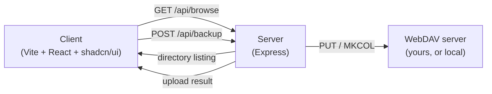
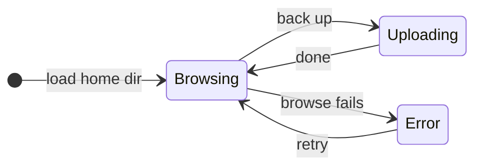

# Backup Tool

A small, self-contained web app for backing up local directories to a WebDAV server — built as a clean demo of a two-tier TypeScript app.

Browse your filesystem in the browser, pick a folder, click one button, and its contents are mirrored to WebDAV.

<p align="left">
  
  
  
  
  
  
</p>

## How it works



1. The client asks the server to list subdirectories of a given path (starting at your home directory).
2. You navigate to the folder you want backed up and click **Back up this folder**.
3. The server recursively walks that folder and mirrors it to the WebDAV server, creating remote directories as needed.

### Directory navigation

Browsing is entirely path-driven — every click just asks the server for a fresh listing of a new path. The server enforces that all paths stay inside your home directory.



## Quick start

Run everything (WebDAV test server, backend, frontend) with one command:

```bash
npm install --prefix server && npm install --prefix client
./start.sh
```

Open `http://localhost:5173`. Press Ctrl+C to stop everything.

<details>
<summary>Or start each piece manually, in its own terminal</summary>

```bash
# 1. Backend
cd server
npm install
cp .env.example .env   # fill in your WebDAV credentials
npm run dev             # http://localhost:3001
```

```bash
# 2. Frontend
cd client
npm install
npm run dev              # http://localhost:5173
```

The frontend proxies API calls to the backend automatically.

</details>

### No WebDAV server handy?

The backend ships with a throwaway local WebDAV server for demos and testing, so you don't need real credentials to try the app:

```bash
cd server
npx tsx webdav-test-server/serve.ts   # http://localhost:1900, demo/demo
```

Point `server/.env` at it:

```
WEBDAV_URL=http://localhost:1900
WEBDAV_USERNAME=demo
WEBDAV_PASSWORD=demo
```

## Project layout

| Path | What |
|---|---|
| [`server/`](server/README.md) | Express + TypeScript API — filesystem browsing and WebDAV upload |
| [`client/`](client/README.md) | React + TypeScript UI — Vite, Tailwind CSS v4, shadcn/ui |
| `server/webdav-test-server/` | Local WebDAV server for dev/demo use, no account required |

See [`CLAUDE.md`](CLAUDE.md) for architecture notes and conventions if you're working on this with an AI coding agent.

## Status

This is a demo project — minimal setup, no auth on the app itself, and directory browsing is scoped to your home directory as a basic safety boundary. Not intended for production use as-is.
